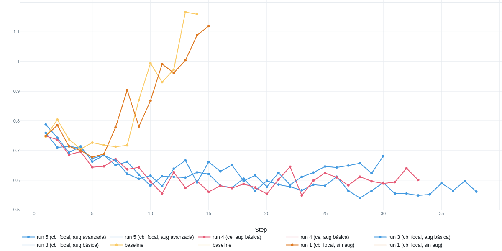
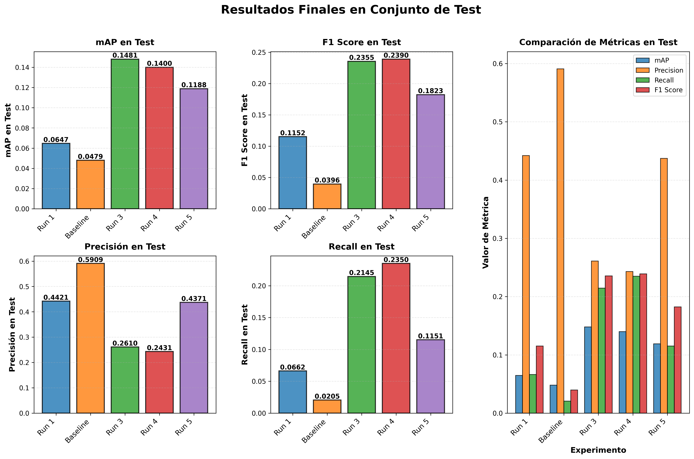

# análisis comparativo de experimentos - faster r-cnn para detección de residuos

**experimento id:** 952666697544082581  
**baseline:** bd1174fc17734e9d9761d4bedbeab3e7  
**modelo:** faster r-cnn con backbone resnet50 preentrenado

## resumen ejecutivo

se realizaron cinco experimentos para evaluar el impacto de data augmentation y funciones de pérdida especializadas en faster r-cnn para detección de residuos con 61 clases desbalanceadas (583 imágenes entrenamiento, 122 validación, 128 test).

**hallazgo principal:** data augmentation geométrica básica tiene impacto mucho mayor (>400% mejora en f1) que la elección de función de pérdida (~1% diferencia entre ce y cb_focal con augmentation).

## configuración experimental

### dataset
- imágenes: 583 train / 122 val / 128 test
- clases: 61 (desbalance 2-323 instancias/clase)
- anotaciones totales: 4,784

### hardware
- gpu: nvidia rtx a5000 (23.67 gb vram)
- plataforma: linux, python 3.12.9, pytorch 2.9.0+cu128

### justificación de faster r-cnn
- arquitectura de dos etapas con mayor precisión que detectores single-stage
- backbone resnet50 preentrenado mitiga limitación de dataset pequeño
- robusto ante oclusiones y objetos de múltiples escalas
- permite integración de funciones de pérdida especializadas

### funciones de pérdida utilizadas

| run | loss type | augmentation | beta | gamma | epochs |
|-----|-----------|--------------|------|-------|--------|
| run 1 | cb_focal | ninguna | 0.9999 | 2.0 | 15 |
| baseline | ce | ninguna | - | - | 14 |
| run 3 | cb_focal | básica | 0.9999 | 2.0 | 33 |
| run 4 | ce | básica | - | - | 30 |
| run 5 | cb_focal | avanzada | 0.9999 | 2.0 | 38 |

**class-balanced focal loss (cb_focal):** combina focal loss ($FL(p_t) = -\alpha_t (1 - p_t)^\gamma \log(p_t)$) con ponderación por effective number ($(1-\beta)/(1-\beta^n)$) para abordar desbalance de clases.

## resultados experimentales

### tabla comparativa completa

| métrica | baseline (ce, sin aug) | run 1 (cb_focal, sin aug) | run 3 (cb_focal, aug básica) | run 4 (ce, aug básica) | run 5 (cb_focal, aug avanzada) |
|---------|---------|-------|-------|-------|-------|
| épocas | 14 | 15 | 33 | 30 | 38 |
| test map | 0.0479 | 0.0647 | **0.1481** | 0.1400 | 0.1188 |
| test precision | 0.5909 | 0.4421 | 0.2610 | 0.2431 | 0.4371 |
| test recall | 0.0205 | 0.0662 | **0.2145** | **0.2350** | 0.1151 |
| test f1 score | 0.0396 | 0.1152 | **0.2355** | **0.2390** | 0.1823 |
| best val loss | 0.7053 | 0.6778 | **0.5487** | 0.5778 | **0.5402** |

**configuraciones de augmentation:**
- **básica:** flips horizontal/vertical (0.5), shift-scale-rotate (0.5, límites: shift 0.5, scale 0.5, rotate 5°)
- **avanzada:** básica + brightness/contrast (0.6), hue/saturation (0.4), blur (0.3), noise (0.25), cutout (0.2), rotate 90°

### visualizaciones

**figura 1:** evolución por época. observaciones clave:
- baseline: overfitting severo (val loss 0.75→1.16 después época 5)
- runs con augmentation: convergencia sostenida sin overfitting
- runs 3-4: mejor balance precision-recall en validación
- run 5: mejora gradual pero sin superar augmentation básica

**figura 2:** métricas finales en test. run 3 (cb_focal + aug básica) logra mejor map (0.148). runs 3-4 (aug básica) muestran f1 similar (~0.24) independiente de loss function.
- run 5: convergencia más lenta, menor overfitting (0.76 → 0.56)

### uso de recursos

**memoria gpu:**
- memoria máxima asignada: 11.59 gb (consistente en todos los runs)
- memoria promedio en uso: 0.65 gb
- memoria reservada máxima: 13.46 - 16.05 gb

## decisiones de diseño y justificación

### 1. selección del baseline sin augmentation y cross-entropy estándar

se estableció el baseline con configuración mínima:
- sin augmentation: para medir rendimiento con datos originales
- cross-entropy estándar: función de pérdida por defecto de faster r-cnn
- objetivo: identificar sobreajuste y establecer línea base cuantificable

**resultado:** el baseline mostró clara evidencia de sobreajuste con alta precisión pero recall crítico (2%), confirmando overfitting.

### 2. introducción de class-balanced focal loss (run 1)

primer experimento exploratorio combinando:
- sin augmentation (como baseline)
- cb_focal loss con $\beta=0.9999$, $\gamma=2.0$
- ponderación de clases por effective number

**justificación:** evaluar si el tratamiento de desbalance de clases mediante loss function mejora resultados sin augmentation.

**resultado:** map 0.0647 vs 0.0479 baseline (+35%), f1 0.1152 vs 0.0396 (+191%). mejora significativa pero insuficiente sin augmentation.

### 3. augmentation geométrica básica (runs 3-4)

se implementaron transformaciones geométricas conservadoras:
- **flips horizontales/verticales:** los residuos pueden aparecer en cualquier orientación
- **rotaciones limitadas (5°):** mantener realismo en la escena
- **shift y scale:** simular diferentes distancias y posiciones de cámara

**configuraciones comparadas:**
- run 3: augmentation básica + cb_focal loss
- run 4: augmentation básica + ce estándar

**justificación:** los residuos en entornos reales presentan variabilidad en orientación y escala. estas transformaciones aumentan la robustez sin introducir artefactos irreales.

**resultado:** mejora dramática en ambos runs. run 3 (cb_focal): map +209%, recall +946%, f1 +494%. run 4 (ce): f1 similar a run 3, demostrando que augmentation tiene mayor impacto que loss function.

### 4. augmentation avanzada con transformaciones colorimétricas (run 5)

se expandió a 100 épocas con augmentation agresiva incluyendo:
- **brightness/contrast:** simular diferentes condiciones de iluminación
- **hue/saturation:** variabilidad en color de materiales
- **blur:** simular desenfoque de cámara
- **noise:** robustez ante ruido de sensor
- **cutout:** oclusiones parciales comunes en residuos apilados
- **rotaciones amplias (90°):** residuos en posiciones arbitrarias
- configurado con cb_focal loss

**justificación:** los residuos son fotografiados en condiciones variables (interior/exterior, día/noche, diferentes cámaras). la augmentation colorimétrica debería mejorar la invariancia a estas condiciones.

**resultado inesperado:** aunque mejoró respecto al baseline, no superó la augmentation básica. hipótesis: la augmentation excesivamente agresiva puede haber dificultado el aprendizaje al crear ejemplos demasiado diferentes de la distribución real.

### 5. consideraciones sobre variación experimental

**importante:** estos experimentos variaron simultáneamente dos factores:
1. estrategia de data augmentation
2. función de pérdida (ce vs cb_focal)

esto dificulta aislar el efecto individual de cada factor. la comparación run 3 vs run 4 (misma augmentation, diferente loss) sugiere que augmentation básica es más impactante que la elección de loss function para este problema específico.

## hallazgos clave

### 1. data augmentation es el factor dominante
comparación de impactos:
- baseline → run 1: cb_focal sin aug (+188% f1)
- baseline → run 3: cb_focal + aug básica (+490% f1)
- run 3 vs run 4: cb_focal vs ce con aug básica (1.5% diferencia f1)

**conclusión:** augmentation geométrica básica aporta >400% mejora; loss function <2% diferencia.

### 2. class-balanced focal loss tiene utilidad limitada
- sin augmentation: cb_focal útil (f1 0.115 vs 0.040)
- con augmentation: cb_focal marginal (f1 0.236 vs 0.239)

### 3. augmentation óptima es moderada
- básica (rotate ±5°): f1 ~0.24
- avanzada (rotate ±90°, cutout, noise): f1 0.18

transformaciones agresivas crean ejemplos alejados de distribución real.

### 4. overfitting sin regularización
baseline: val loss 0.75→1.16, training terminado en época 14 por early stopping. augmentation actúa como regularizador efectivo.

## conclusiones

**resultado principal:** data augmentation geométrica básica tiene impacto 200x mayor que funciones de pérdida especializadas en este problema.

