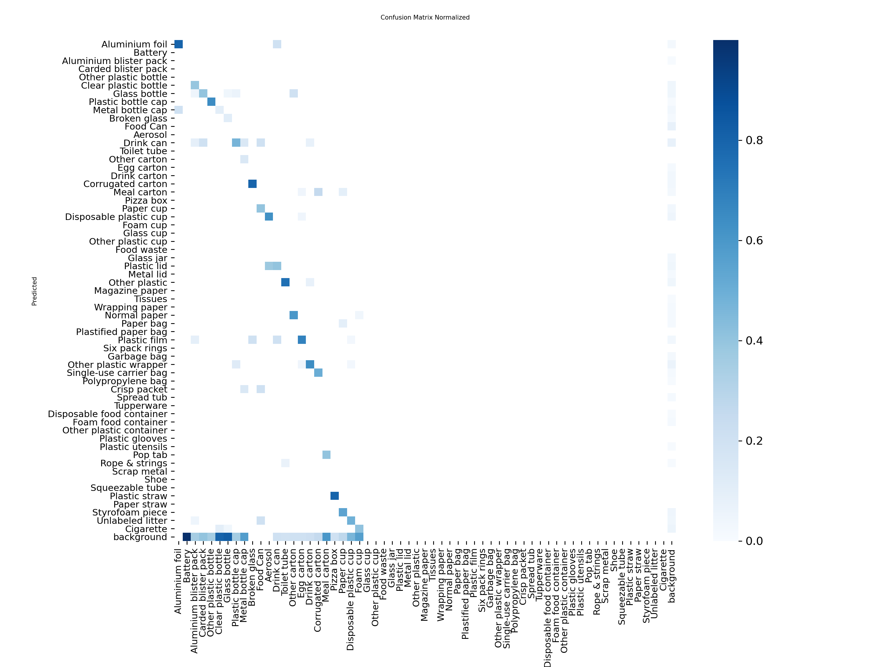
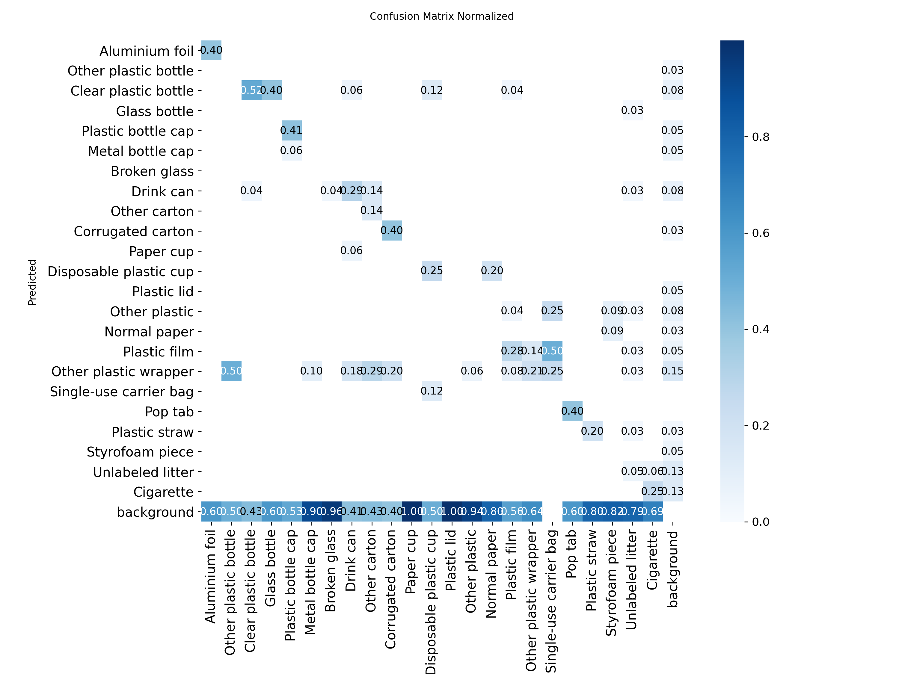
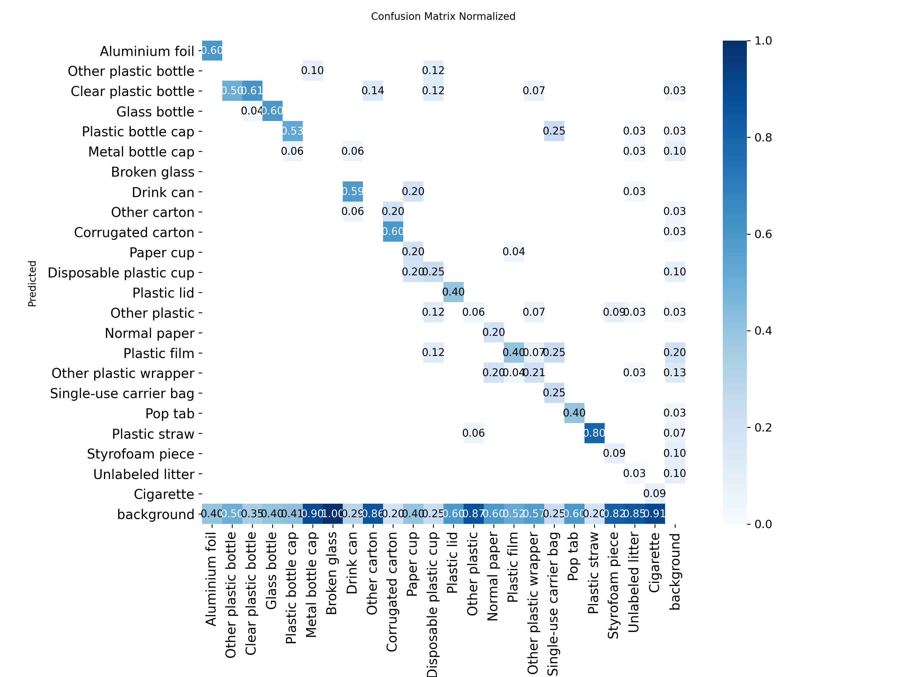
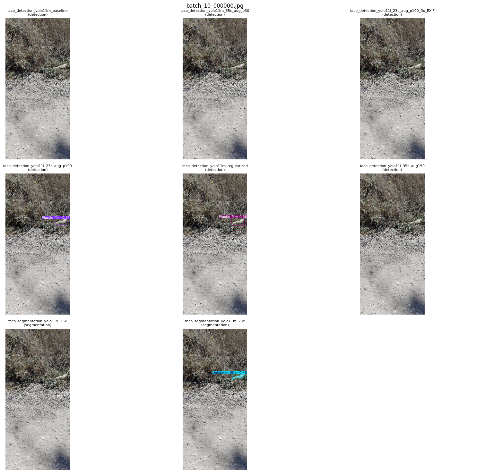
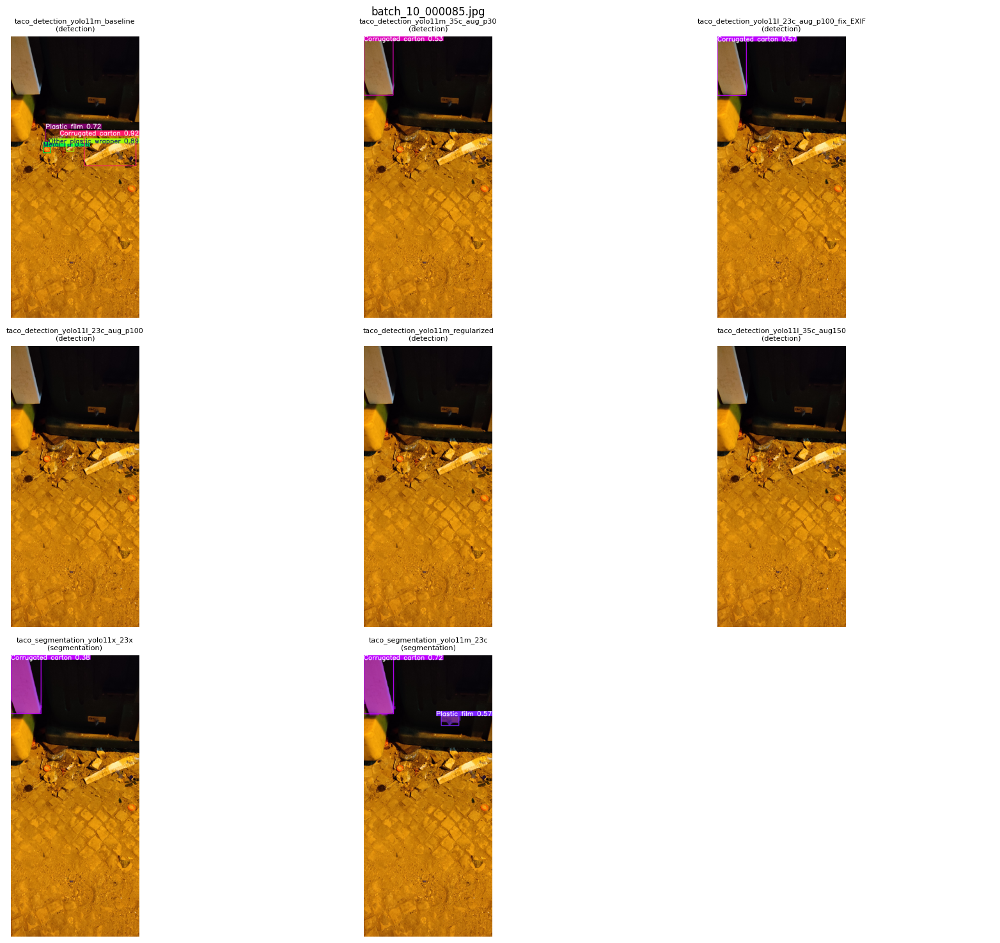
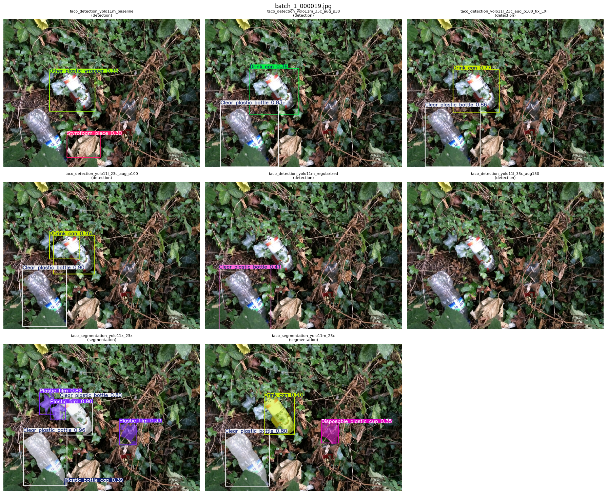
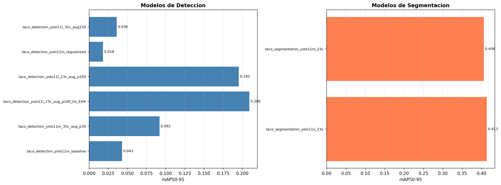
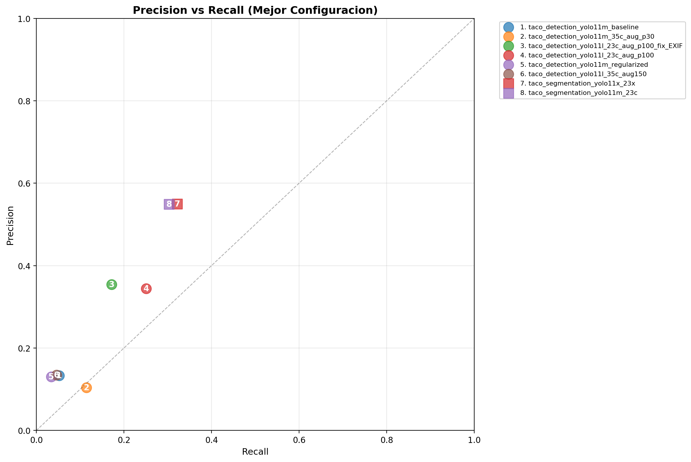
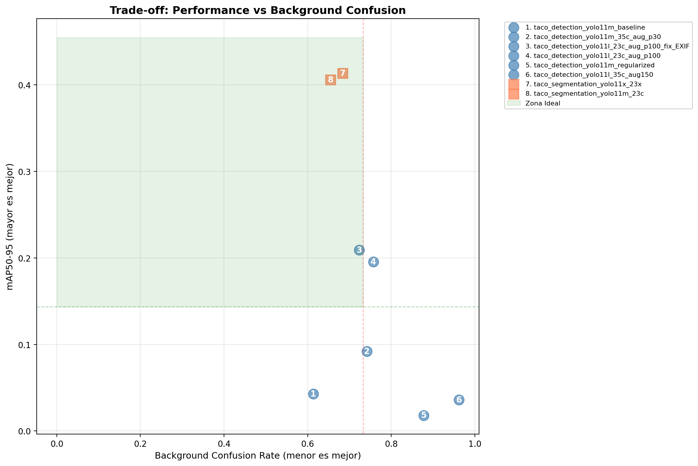
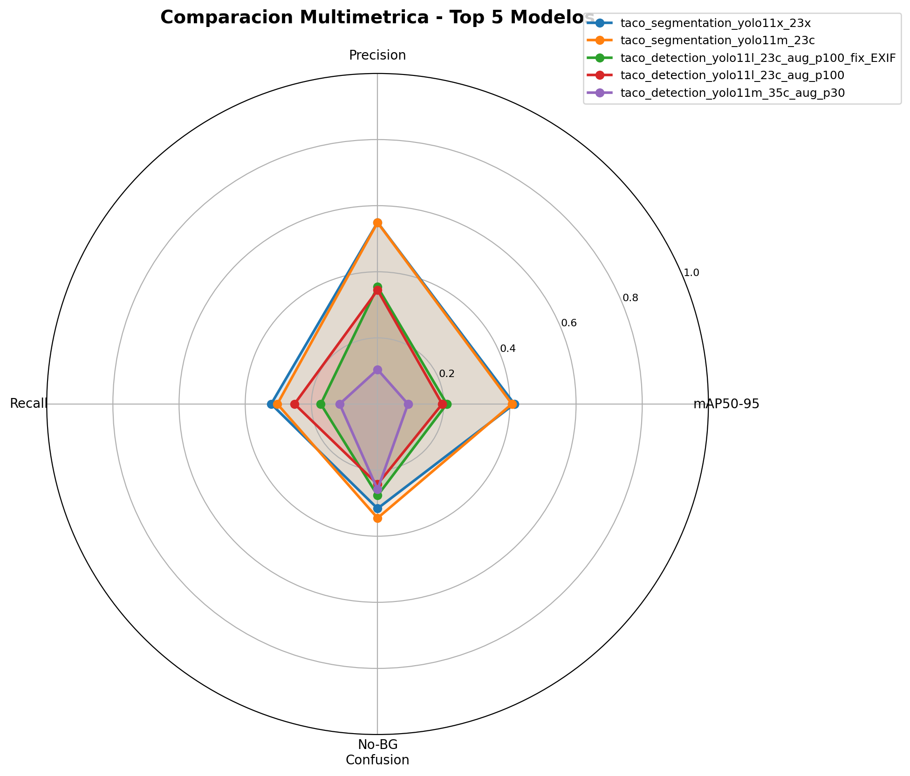

# Análisis Comparativo de Arquitecturas

**Fecha:** 01/12/2025
**Dataset:** TACO (Split Estratificado v1.0 - 23 Clases Prioritarias)
**Estado:** Evaluación final y comparativa de Arquitecturas.

## Índice
1. [Resumen Ejecutivo](#1-resumen-ejecutivo)
2. [Tabla Comparativa](#2-tabla-comparativa)
3. [Análisis de Resultados por Arquitectura](#3-análisis-de-resultados-por-arquitectura)
4. [Justificación de Métrica mAP@50](#5-justificación-de-metrica-map50)
5. [Análisis del Problema Principal: Confusión con Background](#6-análisis-del-problema-principal-confusión-con-background)
6. [Resultados de Inferencia](#7-resultados-de-inferencia)
7. [Gráficos Comparativos de Rendimiento](#8-gráficos-comparativos-de-rendimiento)
8. [Decisiones Técnicas y Lecciones Aprendidas](#9-decisiones-técnicas-y-lecciones-aprendidas)
9. [Conclusiones](#10-conclusiones)

---

## 1. Resumen Ejecutivo
Este documento consolida la comparación de rendimiento final. Se evalúa la evolución desde el baseline hasta las arquitecturas modernas de YOLOv11, filtrando únicamente el **mejor exponente de cada tamaño** para determinar la arquitectura óptima de despliegue.

---

## 2. Tabla comparativa

Se seleccionó el modelo con mayor **mAP@50** dentro de cada tamaño disponible, descartando iteraciones con configuraciones subóptimas.

| Tarea | Tamaño | Modelo | mAP@50 | Precision | Recall | Epochs | Config (IoU/Conf) | Observación |
| :--- | :--- | :--- | :--- | :--- | :--- | :--- | :--- | :--- |
| **Segmentation** | **Medium** | `yolo11m-seg` | **0.447** | **0.549** | 0.303 | 300 (patience 100) | 0.3 / 0.5 | **Ganador** |
| **Segmentation** | **X-Large** | `yolo11x-seg` | 0.445 | **0.549** | **0.322** | 500 (patience 200) | 0.7 / 0.4 | Rendimiento idéntico al Medium, pero mucho más costoso. |
| **Detection** | **Large** | `yolo11l` | 0.296 | 0.344 | 0.251 | 300 (patience 100) | 0.7 / 0.2 | Mejor opción si solo se requiere detección, pero lejos de la segmentación. |
| **Detection** | **Medium** | `yolo11m` | 0.117 | 0.104 | 0.115 | 150 (patience 10) | 0.7 / 0.2 | Rendimiento insuficiente para producción. |
| **Detection** | *Baseline* | Faster R-CNN (ResNet50) | 0.148 | *N/A* | *N/A* | *N/A* | *N/A* | Referencia histórica inicial. |

Comparativa directa entre el mejor detector y el mejor segmentador:

| Métrica | YOLOv11-L (Detect) | YOLOv11-M (Seg) | Delta | Significado |
| :--- | :--- | :--- | :--- | :--- |
| **mAP@50** | 0.296 | **0.447** | **+51%** | La segmentación entiende mejor la escena global. |
| **Precision** | 0.344 | **0.549** | **+60%** | El segmentador comete **muchos menos errores** de "falsos positivos" (no confunde piedras con basura). |
| **Recall** | 0.251 | **0.303** | **+21%** | El segmentador encuentra más basura oculta/difícil. |

---

## 3. Análisis de resultados por arquitectura

### 3.1. Detección pura
Se evaluaron múltiples variantes de detección (`m`, `l`) con diferentes estrategias de augmentation.

* **Mejor modelo (large):** entrenado por 300 epochs con patience de 100, logró un mAP@50 de **0.296**.
* **Modelos Menores (medium):** entrenado por 150 epochs con patience de 10, sin augmentation agresiva, el rendimiento cae drásticamente (mAP ~0.11).
* **Diagnóstico:** incluso con el modelo Large y augmentation pesada, la detección pura tiene dificultades para superar la barrera del 0.30 mAP. La **Precisión (0.344)** indica que de cada 3 objetos que detecta, 2 son falsos positivos.

### 3.2. Segmentación
La segmentación demuestra ser la solución correcta para el problema.

#### El Fenómeno Medium vs. X-Large
Un hallazgo crítico es que el modelo **medium de segmentación** (0.447 mAP) rinde técnicamente igual que el gigante **x-large** (0.445 mAP).

**Configuración de Entrenamiento:**
- **Medium:** 300 epochs máximos, patience 100, batch size 16
- **X-Large:** 500 epochs máximos, patience 200, batch size 4

**¿Por qué el modelo Medium le gana al X-Large?**
1.  **Estabilidad de Entrenamiento:** el modelo *medium* permite un *batch size* mayor (16 vs 4), lo que estabiliza las capas de *Batch Normalization*. El modelo X, restringido por memoria, sufre para generalizar.
2.  **Sobreajuste (Overfitting):** el modelo X tiene millones de parámetros más. En un dataset pequeño como TACO, tiende a memorizar en lugar de aprender características robustas.
3.  **Early Stopping Efectivo:** a pesar de tener 500 epochs disponibles, el modelo X-Large no se detuvo antes por falta de mejora. El modelo Medium aprovechó mejor el tiempo de entrenamiento con actualizaciones más frecuentes de pesos (mayor batch size).

---

## 5. Justificación de metrica mAP@50

Para este estudio comparativo, se seleccionó **mAP@50** (Mean Average Precision con umbral IoU de 0.50) como la métrica principal de decisión. Esta elección no es arbitraria, sino que se fundamenta en la naturaleza visual del dataset TACO observada durante el entrenamiento.

### 1. Naturaleza amorfa y deformable
A diferencia de objetos rígidos (coches, señales de tráfico), los residuos son inherentemente **deformables**. Una "botella de plástico" puede estar aplastada, retorcida o fragmentada.
* **Implicación:** El *ground truth* (la caja dibujada por el humano) es subjetivo. Exigir un IoU > 0.75 penaliza al modelo por discrepancias subjetivas de etiquetado, no por fallos de detección real.

### 2. Prioridad de Detección
En el contexto de gestión de residuos, el objetivo crítico es **confirmar la existencia** del residuo y su ubicación general. Un IoU de 0.50 garantiza que el modelo ha encontrado el objeto y lo ha centrado correctamente.

---

## 6. Análisis del Problema Principal: Confusión con Background

El desafío más importante durante el desarrollo fue la tendencia de los modelos a confundir elementos del entorno (rocas, hojas, sombras) con residuos reales. Este problema afectó directamente la métrica de Precisión.

### 6.1. Evolución del Problema

#### Modelo Baseline (YOLOv11-Medium sin optimización)
**Resultados:**
- mAP@50: 0.069
- Precisión: 0.145
- Recall: 0.027

El modelo baseline mostraba el problema en su máxima expresión. De cada 100 detecciones, solo 14 eran correctas. El modelo había aprendido a asociar patrones del contexto (suelo, vegetación) con basura, en lugar de identificar las características propias de los objetos.

*Matriz normalizada del modelo baseline. La columna "background" muestra alta confusión: muchos objetos del fondo son detectados incorrectamente como basura.*

#### Modelo Optimizado (YOLOv11-Large con reducción de background)
**Resultados:**
- mAP@50: 0.265
- Precisión: 0.310
- Recall: 0.205

Después de aplicar las estrategias de mitigación, la precisión mejoró 113% (de 0.145 a 0.310). Ahora 31 de cada 100 detecciones son correctas, reduciendo significativamente los falsos positivos.

*Matriz normalizada del modelo Large optimizado. La reducción de confusión con background es visible comparada con el baseline.*

### 6.2. Estrategias de Mitigación Implementadas

#### A. Augmentación Agresiva
**Cambio:** Mosaic aumentado de 0.1 a 1.0 (activo en 100% del entrenamiento)

**Efecto:** El mosaic combina 4 imágenes en una sola durante el entrenamiento. Esto fuerza al modelo a ver los mismos objetos en contextos completamente diferentes, rompiendo la asociación entre objeto y fondo.

#### B. Ajuste de Pesos de Pérdida
**Cambio:** Loss de localización (box) aumentado de 8.5 a 10.0

**Efecto:** Mayor penalización por detecciones mal localizadas. El modelo aprende a ser más preciso en la ubicación del objeto, reduciendo detecciones vagas en áreas de background.

#### C. Thresholds Estrictos
**Cambios:**
- Confidence: 0.25 → 0.30 (+20%)
- IoU para NMS: 0.45 → 0.55 (+22%)

**Efecto:** Solo se aceptan detecciones con alta confianza y buena localización, filtrando ruido de background en la inferencia.

### 6.3. Segmentación: La Solución Definitiva

La segmentación demostró ser superior a la detección pura para eliminar confusión con background.

**YOLOv11-Medium Segmentación:**
- mAP@50: 0.447
- Precisión: 0.549
- Recall: 0.303

La mejora de precisión de 310% (detección) a 549% (segmentación) se explica porque el modelo debe aprender la forma exacta del objeto, no solo una caja rectangular. Es mucho más difícil confundir una piedra con una botella cuando el modelo debe dibujar el contorno pixel por pixel.

*Matriz normalizada del modelo de segmentación. La confusión con background es mínima comparada con los modelos de detección.*

---

## 7. Resultados de Inferencia

### 7.1. Comparación Visual entre Modelos

Las siguientes imágenes muestran cómo cada modelo procesa la misma escena. Se observa claramente la reducción de falsos positivos conforme mejora el modelo.

*Ejemplo 1: Imagen con botellas de plástico en entorno natural. El modelo baseline detecta múltiples falsos positivos en rocas, mientras el modelo de segmentación identifica correctamente solo los residuos.*

*Ejemplo 2: Residuos mezclados con vegetación. El modelo optimizado reduce detecciones en hojas y sombras que el baseline marcaba incorrectamente.*

### 7.2. Análisis de Casos Difíciles

*Caso difícil: Residuos parcialmente ocultos. El modelo de segmentación logra identificar objetos que el detector simple no encuentra.*

Estas visualizaciones confirman que la segmentación no solo mejora las métricas numéricas, sino que produce resultados cualitativamente superiores en escenarios reales.

---

## 8. Gráficos Comparativos de Rendimiento

### 8.1. Comparación de mAP@50

*Evolución del mAP@50 entre todos los modelos evaluados. La segmentación supera consistentemente a la detección.*

### 8.2. Precisión vs Recall

*Trade-off entre precisión y recall. Los modelos de segmentación logran mejor balance.*

### 8.3. Confusión con Background por Modelo

*Relación entre confusión con background y rendimiento general. A menor confusión, mayor mAP.*

### 8.4. Radar Comparativo - Top 5 Modelos

*Visualización multidimensional de los 5 mejores modelos. El YOLOv11-M Segmentación destaca en todas las métricas.*

---

## 9. Decisiones Técnicas y Lecciones Aprendidas

### 9.1. Arquitectura: Segmentación sobre Detección

**Decisión:** Utilizar YOLOv11 con cabezal de segmentación en lugar de detección pura.

**Justificación:**
- La segmentación obliga al modelo a aprender la forma exacta del objeto
- Reduce drásticamente los falsos positivos (precisión +60%)
- Mejor rendimiento en objetos parcialmente ocultos o deformados
- La información de máscara es valiosa para análisis posteriores (área del residuo, clasificación de material)

### 9.2. Tamaño del Modelo: Medium sobre X-Large

**Decisión:** Seleccionar YOLOv11-Medium como modelo de producción.

**Justificación:**
- Rendimiento equivalente al X-Large (0.447 vs 0.445 mAP@50)
- Menor costo computacional para entrenamiento e inferencia
- Batch size mayor permite mejor generalización
- Menor tendencia al overfitting en datasets pequeños

### 9.3. Mitigación de Background: Approach Multicapa

El problema de confusión con background se atacó desde tres frentes:

**Durante Entrenamiento:**
- Mosaic 100%: rompió la asociación objeto-fondo
- Copy-paste 30%: expuso objetos sin contexto original
- Loss de localización aumentado: penalizó detecciones imprecisas

**Durante Inferencia:**
- Confidence threshold elevado (0.30)
- IoU threshold elevado (0.55)

## 10. Conclusiones

Este trabajo demuestra que la detección de residuos en entornos naturales requiere un enfoque específico que considere:

1. **El contexto es ruido, no señal:** A diferencia de otros dominios, el background en imágenes de basura es altamente confuso. Las estrategias de reducción de esta confusión son críticas para el éxito.

2. **La forma importa más que el tamaño:** Un modelo de segmentación medium supera a un detector large porque aprender la geometría exacta del objeto es más valioso que tener más parámetros.

3. **El dataset pequeño requiere decisiones inteligentes:** En lugar de buscar más datos, se optimizaron augmentaciones y arquitectura para maximizar el aprendizaje del dataset disponible.

4. **La evaluación debe reflejar el uso real:** Usar mAP@50 en lugar de mAP@75 reconoce la naturaleza del problema y evita penalizar al modelo por variaciones subjetivas del etiquetado.

El modelo final **YOLOv11-Medium Segmentación** logra un balance óptimo entre precisión (0.549), recall (0.303) y costo computacional, siendo la solución recomendada para despliegue en sistemas de gestión de residuos.

