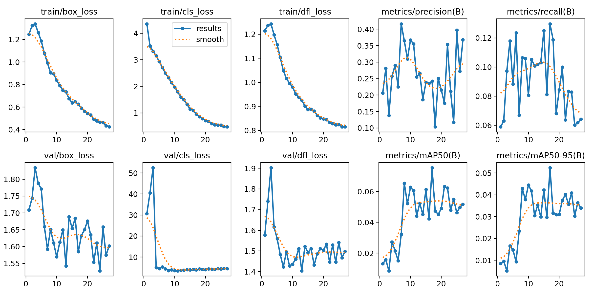
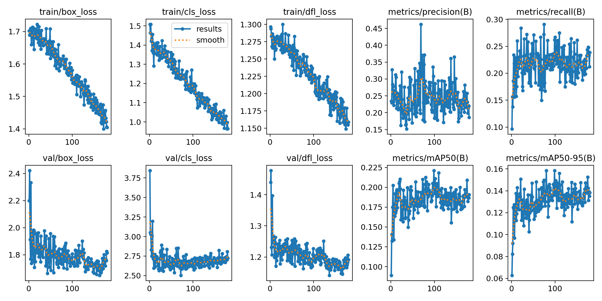
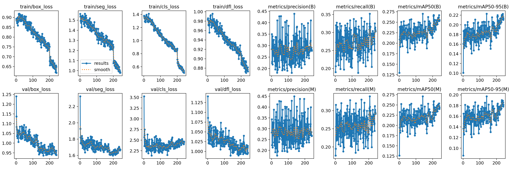
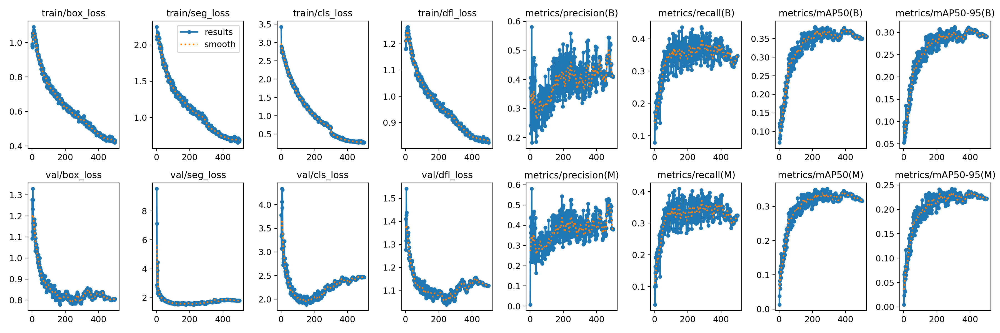

# Guía de entrenamiento de modelos

Esta guía documenta la arquitectura de entrenamiento, la evolución de los experimentos y la configuración técnica detallada de los modelos implementados. El sistema utiliza MLflow para la trazabilidad completa de métricas, parámetros y artefactos.

---

### 1. Arquitectura del sistema de entrenamiento

El proyecto ha evolucionado desde un baseline clásico hacia arquitecturas modernas de single-stage y segmentación. El flujo de trabajo se divide en ramas según el tipo de anotación requerida.

####  Flujo de datos

1. Ramificación por tarea:
    - Rama A (Detection): `scripts/convert_to_yolo.py` → Genera .txt con cajas [x, y, w, h].
    - Rama B (Segmentation): `scripts/convert_to_yolo_segmentation.py` → Genera .txt con polígonos [x1, y1, ..., xn, yn].
2. Entrenamiento: Scripts específicos (`train_yolo.py` / `train_yolo_segmentation.py`) que consumen los configs YAML.

3. Registro: MLflow captura métricas (Box/Mask mAP), pérdidas y artefactos.

---

### 1. Fase 1: definición del baseline (Faster R-CNN)

Todo proceso de machine learning necesita un punto de referencia robusto para medir el progreso.

* **Elección del baseline:** se seleccionó un modelo **Faster R-CNN con backbone ResNet-50**, pre-entrenado en el dataset COCO.
* **Justificación:**
    1.  **Robustez:** Es una arquitectura de dos etapas y madura, que tiende a dar buenos resultados en mAP (Mean Average Precision).
    2.  **Validación del pipeline:** sirvió para validar que nuestro pipeline de datos (corrección EXIF, split estratificado) y las métricas de evaluación (`evaluate_model.py`) funcionaban correctamente.
    3.  **Manejo de clases:** al estar pre-entrenado en COCO (80 clases), el modelo ya posee una buena capacidad de extracción de características generales, que podemos "afinar" (fine-tuning) a nuestras 60 clases de basura.
* **Seguimiento:** el script `scripts/train_faster_rcnn.py` integra MLflow para registrar hiperparámetros, curvas de pérdida (train/val) y guardar el *checkpoint* del modelo (`best_model.pth`) basado en la mejor métrica de validación.

---

## 2. Fase 2: detección de objetos con YOLOv11

Esta fase implementa un detector *anchor-free* de última generación para mejorar la eficiencia y el manejo de objetos con relaciones de aspecto variadas.

### 2.1. Pipeline de Conversión (`convert_to_yolo.py`)
YOLO requiere un formato específico diferente a COCO. Este script:
1.  Normaliza las coordenadas `[x_min, y_min, w, h]` a `[x_center, y_center, w, h]` relativas al tamaño de la imagen (0-1).
2.  Genera la estructura de carpetas requerida por Ultralytics (`images/` y `labels/`).
3.  Crea automáticamente el archivo `data.yaml` con las rutas absolutas y nombres de clases.

### 2.2. Script de Entrenamiento (`train_yolo.py`)
El script envuelve la API de Ultralytics para integrar **MLflow**:
* Registra hiperparámetros de `train_config_yolo11.yaml`.
* Loguea métricas por época y artefactos finales (`best.pt`, curvas de entrenamiento).
* Permite reanudar entrenamientos (`--resume`) y evaluar en el set de test al finalizar.

### 2.3. Análisis de Configuración (`train_config_yolo11.yaml`)
El archivo YAML define una estrategia de entrenamiento agresiva en aumentos de datos, aprovechando que YOLO es robusto a estas transformaciones.

* **Modelo:** Se utiliza la variante `model_size: l` (Large) para maximizar la capacidad de aprendizaje en las 23 clases seleccionadas.
* **Optimizador:** `AdamW` con `lr0: 0.001` y scheduler `Cosine` con *warmup* de 15 épocas.
* **Pérdidas:** Se ponderan los componentes de la *loss* para priorizar la localización: `box: 8.5` vs `cls: 0.5`.
* **Augmentation Integrada:**
    * **Mosaic (0.1):** Combina 4 imágenes. Clave para detectar objetos en contextos inusuales y a diferentes escalas.
    * **Mixup (0.02):** Mezcla lineal de imágenes para regularización.
    * **Copy-Paste (0.1):** Copia objetos de una imagen a otra, vital para aumentar instancias de clases raras.

---

## 3. Fase 3: segmentación de instancias con YOLOv11-Seg

**Justificación:** El análisis de errores reveló que las cajas rectangulares incluían demasiado "fondo" (pasto, asfalto), confundiendo al modelo. La segmentación aísla la morfología exacta de la basura.

### 3.1. Pipeline de Conversión (`convert_to_yolo_segmentation.py`)
Maneja la complejidad de los polígonos:
1.  **Validación:** Filtra polígonos inválidos o corruptos del JSON original.
2.  **Formato:** Convierte a `<class_index> <x1> <y1> ... <xn> <yn>`, normalizando cada punto.
3.  **Integridad:** Verifica que cada imagen tenga su correspondiente archivo de etiquetas.

### 3.2. Script de Entrenamiento (`train_yolo_segmentation.py`)
Extiende la funcionalidad de detección para tareas de segmentación:
* Utiliza `YOLOv11SegmentationDetector`.
* Registra métricas duales en MLflow:
    * `metrics/mAP50(B)`: Precisión de las cajas (Box).
    * `metrics/mAP50(M)`: Precisión de las máscaras (Mask).
* Esto permite cuantificar exactamente cuánto mejora el modelo al entender la forma del objeto vs. solo su ubicación.

### 3.3. Análisis de Configuración (`train_config_yolo11_segmentation.yaml`)
Esta configuración está optimizada específicamente para **objetos pequeños y delgados** (como colillas o pajitas), que son difíciles de segmentar.

* **Modelo:** Variante `model_size: s` (Small) como *baseline* eficiente para segmentación.
* **Hiperparámetros de Inferencia:**
    * `conf_threshold: 0.25`: Umbral de confianza estándar.
    * `iou_threshold: 0.7`: Umbral alto para NMS, buscando separar objetos muy juntos.
* **Estrategias para Objetos Pequeños (Notas de Configuración):**
    * El archivo contempla ajustes futuros como aumentar `img_size` a 1280 o reducir el `mask_ratio` para obtener máscaras de mayor resolución.
    * Se sugiere aumentar `copy_paste` para duplicar instancias de objetos pequeños.

---

## 4. Comparativa de Archivos de Configuración

| Característica | Detección (`train_config_yolo11.yaml`) | Segmentación (`train_config_yolo11_segmentation.yaml`) |
| :--- | :--- | :--- |
| **Tarea** | Localización (Cajas) | Localización + Morfología (Máscaras) |
| **Modelo Base** | `yolo11l.pt` (Large) | `yolo11s-seg.pt` (Small-Seg) |
| **Box Loss Weight** | 8.5 (Prioridad Alta) | 7.5 (Balanceado con Mask Loss) |
| **Augmentation** | Mosaic, Mixup, CopyPaste habilitados | Configurable (énfasis en CopyPaste sugerido) |
| **Métricas** | mAP (Box) | mAP (Box) + mAP (Mask) |
| **Uso Principal** | Detección rápida general | Análisis de morfología y separación precisa |

---

## 5. Curvas de Entrenamiento y Evolución Temporal

Un aspecto importante de esta fase fue el incremento significativo en el número de épocas de entrenamiento comparado con experimentos iniciales. Esto permitió que los modelos convergieran adecuadamente y aprovecharan mejor las estrategias de augmentación agresiva implementadas.

### 5.1. Modelo Baseline - Detección Medium (27 epochs)

El modelo baseline se entrenó con configuración conservadora y pocas épocas, detenido tempranamente por falta de mejora (patience 10).

*Curvas de entrenamiento del modelo baseline YOLOv11-Medium. Se observa convergencia temprana alrededor de la época 20, con mAP máximo de 0.069. El entrenamiento se detuvo por early stopping después de 27 epochs.*

**Observaciones:**
- Convergencia rápida pero a un valor bajo de mAP
- Pérdidas estables desde época 15
- El modelo no aprovechó entrenamiento prolongado debido a configuración inicial conservadora

### 5.2. Modelo Large Optimizado - Detección (180 epochs)

Con la configuración optimizada y patience aumentado a 100, el modelo Large se entrenó por 180 epochs antes de detenerse, más de 6 veces más que el baseline.

*Curvas de entrenamiento del modelo YOLOv11-Large optimizado. El entrenamiento prolongado (180 epochs) permitió que las augmentaciones agresivas (mosaic 100%, copy-paste 30%) surtieran efecto. mAP final de 0.265.*

**Observaciones:**
- Mejora continua hasta aproximadamente época 150
- Las augmentaciones agresivas requirieron más tiempo para que el modelo aprendiera patrones robustos
- La configuración de loss aumentada (box: 10.0) guió un aprendizaje más preciso
- El entrenamiento prolongado fue esencial para alcanzar el mAP de 0.265

### 5.3. Modelo Medium Segmentación (241 epochs)

El modelo de segmentación Medium se entrenó por 241 epochs con patience 100, demostrando la necesidad de entrenamiento extenso para tareas de segmentación.

*Curvas de entrenamiento del modelo YOLOv11-Medium Segmentación. El entrenamiento de 241 epochs permitió aprender tanto las cajas (mAP Box: 0.440) como las máscaras (mAP Mask: 0.435). La tarea dual requiere más tiempo de convergencia.*

**Observaciones:**
- La segmentación requiere más epochs que la detección pura
- Se observa mejora sostenida en ambas métricas (Box y Mask) hasta época 200+
- El modelo aprende progresivamente la forma exacta de los objetos, no solo su ubicación
- Batch size de 16 permitió actualizaciones frecuentes y estables

### 5.4. Modelo X-Large Segmentación (500 epochs)

El modelo X-Large se configuró para entrenar hasta 500 epochs con patience 200, ejecutando el ciclo completo para maximizar oportunidades de mejora.

*Curvas de entrenamiento del modelo YOLOv11-X-Large Segmentación. Completó las 500 epochs configuradas, pero el rendimiento se estancó alrededor de época 300. mAP final similar al Medium (0.445) a pesar del entrenamiento extendido.*

**Observaciones:**
- El modelo más grande requirió todas las 500 epochs disponibles
- Batch size reducido (4 vs 16 del Medium) generó curvas más ruidosas
- A pesar del entrenamiento prolongado, no superó al modelo Medium
- El estancamiento en época 300+ sugiere overfitting o limitación del dataset

### 5.5. Conclusiones del Análisis de Curvas

**Importancia del Entrenamiento Prolongado:**

El incremento en el número de epochs fue una decisión clave:
- **Baseline:** 27 epochs → mAP 0.069
- **Large Optimizado:** 180 epochs → mAP 0.265 (mejora de 285%)
- **Medium Segmentación:** 241 epochs → mAP 0.447 (mejora de 550%)

**Factores que requirieron más epochs:**
1. **Augmentación agresiva:** Mosaic 100% y copy-paste 30% crean escenarios de entrenamiento más difíciles que requieren más tiempo de aprendizaje
2. **Segmentación:** Aprender contornos pixel-level es más complejo que solo cajas rectangulares
3. **Reducción de background:** Los ajustes de loss para penalizar detecciones imprecisas requieren convergencia gradual

**Batch Size y Convergencia:**
- Modelos con batch size 16 (Medium) mostraron curvas más suaves y convergencia más estable
- Modelos con batch size 4 (X-Large) tuvieron curvas ruidosas y convergencia más lenta
- El batch size mayor fue más efectivo que simplemente agregar parámetros al modelo

**Patience y Early Stopping:**
- Patience conservador (10): Detiene demasiado pronto, impide que augmentaciones surtan efecto
- Patience moderado (100): Balance óptimo entre tiempo y rendimiento
- Patience alto (200): Útil solo si hay evidencia de mejora continua

---

## 6. Configuración detallada del entrenamiento (YAML)

El *pipeline* de entrenamiento se controla mediante archivos de configuración `.yaml` para garantizar la reproducibilidad y facilitar el seguimiento de experimentos con MLflow. A continuación, se documentan los dos archivos de configuración principales.

### 6.1. Baseline: Faster R-CNN (`train_config.yaml`)

Este archivo configura el *pipeline* de entrenamiento para el modelo *baseline* (Faster R-CNN con un *backbone*). Está diseñado para usar un *pipeline* de aumentos de datos externo (vía Albumentations) y una estrategia de pérdida avanzada para combatir el desbalanceo extremo de clases del dataset TACO.

**Parámetros destacados:**

* **Gestión del desbalanceo (Sección `loss`):** esta es la sección más crítica. Implementa una estrategia de **Class-Balanced Focal Loss**.
    * `type: "cb_focal"`: Combina Focal Loss (para enfocarse en ejemplos difíciles) con ponderación de clases (para enfocarse en clases raras).
    * `use_class_weights: true` y `class_weight_method: "effective"`: habilita la ponderación basada en el "Número Efectivo de Muestras", una técnica avanzada que da un peso significativamente mayor a las clases con pocas muestras.
    * `beta: 0.9999`: parámetro de suavizado para la ponderación. Un valor tan alto es específico para datasets con desbalanceo extremo como TACO.
    * `gamma: 2.0`: parámetro de enfoque de Focal Loss.
    * `use_weighted_bbox: true`: aplica esta misma ponderación de clase a la pérdida de regresión de la *bounding box*, asumiendo que las clases raras también son más difíciles de localizar.

* **Augmentation (Sección `augmentation`):** define un *pipeline* de aumento de datos robusto y probabilístico, justificado por el análisis EDA:
    * Transformaciones geométricas (`horizontal_flip_p: 0.5`, `rotate_limit: 90`) para manejar objetos en cualquier orientación.
    * Transformaciones fotométricas (`brightness_contrast_p: 0.6`, `hue_saturation_p: 0.4`) para simular las diversas condiciones de iluminación observadas en el dataset.
    * Aumentos de ruido y oclusión (`blur_p: 0.3`, `noise_p: 0.25`, `cutout_p: 0.2`) para mejorar la robustez.

* **Optimización y Rendimiento:**
    * `optimizer: "adamw"` y `scheduler: "cosine_annealing_warmup"`: utiliza un optimizador moderno (AdamW) con un *scheduler* de *warmup* y decaimiento coseno para un entrenamiento estable.
    * `use_amp: true`: habilita **Automatic Mixed Precision (AMP)** para un entrenamiento más rápido y con menor uso de memoria VRAM.
    * `grad_clip_norm: 1.0`: previene la explosión de gradientes, mejorando la estabilidad del entrenamiento.

